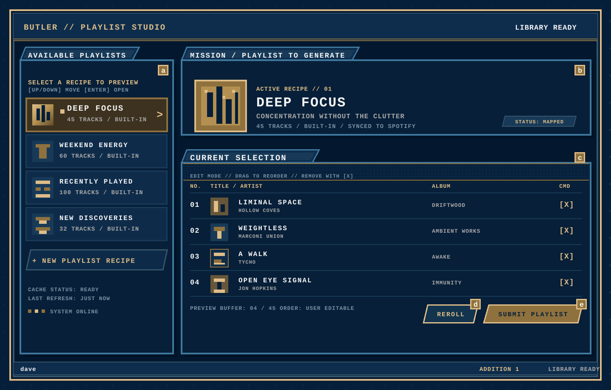

# Spotify Butler API and client finalization

This is a proposed browser-client contract for the Kotlin service. The route list below follows the current public
HTTP server and `kt/src/main/resources/openapi.yaml`. The `/start` and `/callback` routes are included because they are
the public OAuth entry points even though they are not browser JSON resources.

## API spec

The API uses the opaque `butler_session` cookie for authenticated requests. State-changing requests also send the
session's `X-CSRF-Token` and a configured trusted `Origin`. JSON request bodies use `Content-Type: application/json`.

```text
GET /health
 - params: none
 - purpose: public readiness check; returns {status: "ready"}

GET /start
 - params: optional query returnTo (relative path), optional query refresh (true|false)
 - purpose: start Spotify Authorization Code login and redirect to Spotify

GET /callback
 - params: query code and state, state cookie, optional query dryRun for legacy refresh callbacks
 - purpose: validate the Spotify callback, create the Butler session cookie, and redirect or return the legacy summary

GET /api/v1/session
 - params: butler_session cookie
 - purpose: return the signed-in Spotify user, CSRF token, and session expiry

DELETE /api/v1/session
 - params: butler_session cookie; X-CSRF-Token header; trusted Origin header
 - purpose: invalidate the current Butler session

POST /api/v1/session/refresh
 - params: butler_session cookie; X-CSRF-Token header; trusted Origin header
 - purpose: exchange the server-side Spotify refresh token and rotate the Butler session cookie

GET /api/v1/playlists
 - params: butler_session cookie
 - purpose: list built-in and owner-scoped playlist-to-generate definitions with mapping state

POST /api/v1/playlists
 - params: butler_session cookie; X-CSRF-Token header; trusted Origin header; JSON body {name, trackIds?}
 - purpose: create an owner-scoped playlist-to-generate definition

GET /api/v1/playlists/{definitionId}
 - params: butler_session cookie; path definitionId
 - purpose: return one playlist-to-generate definition and its mapped Spotify playlist, if any

PUT /api/v1/playlists/{definitionId}
 - params: butler_session cookie; path definitionId; X-CSRF-Token header; trusted Origin header; JSON body {name, trackIds?}
 - purpose: replace an owner-scoped playlist definition's name and editable track IDs

GET /api/v1/playlists/{definitionId}/current
 - params: butler_session cookie; path definitionId
 - purpose: return the current ordered, ID-only contents of the mapped Spotify playlist

POST /api/v1/playlists/{definitionId}/syncs
 - params: butler_session cookie; path definitionId; X-CSRF-Token header; trusted Origin header; JSON body {trackIds}
 - purpose: replace the mapped Spotify playlist with the submitted order and return authoritative current IDs

GET /api/v1/library
 - params: butler_session cookie
 - purpose: return cache status, owner, completion time, and bounded library counts

POST /api/v1/library/refresh
 - params: butler_session cookie; X-CSRF-Token header; trusted Origin header
 - purpose: refresh the server-side Spotify cache and return the resulting library status

POST /api/v1/run
 - params: butler_session cookie; X-CSRF-Token header; trusted Origin header
 - purpose: deprecated compatibility alias for a full cache refresh; new clients should use /api/v1/library/refresh

GET /api/v1/songs
 - params: butler_session cookie; required query ids (comma-separated Spotify track IDs, maximum 50)
 - purpose: enrich track IDs in requested order and report missing IDs once

GET /api/v1/songs/{trackId}
 - params: butler_session cookie; path trackId
 - purpose: return typed metadata for one cached Spotify track
```

Successful JSON responses and reusable sanitized error responses are defined in `kt/src/main/resources/openapi.yaml`.
Playlist submission accepts at most 5,000 track IDs; song enrichment accepts at most 50 normalized IDs.

## Fixed-text client concept

The following is the same interaction model as the SVG below, kept deliberately low-fidelity so the product boundary is
clear in a terminal or design review. Lettered markers are repeated in the rendered SVG.

```text
┌──────────────────────────────────────────────────────────────────────────────────────────────────────────────┐
│  o BUTLER   playlist studio                                      library ready   O philip                  (f) │
├────────────────────────────────┬─────────────────────────────────────────────────────────────────────────────┤
│  AVAILABLE PLAYLISTS      (a)  │  PLAYLIST TO GENERATE                                      (b)              │
│  Choose a recipe to preview    │  ┌──────────┐  Deep Focus                                                   │
│  ┌──────────────────────────┐  │  │ cover    │  Concentration without the clutter · 45 tracks              │
│  │ [D] Deep Focus       >    │  │  └──────────┘  Built-in recipe - synced to Spotify playlist              │
│  │    45 tracks - built-in  │  ├─────────────────────────────────────────────────────────────────────────┤
│  └──────────────────────────┘  │  CURRENT SELECTION                                      (c)              │
│  ┌──────────────────────────┐  │  Drag to reorder · remove tracks · next submit replaces playlist        │
│  │ [W] Weekend Energy       │  │                                                                             │
│  │    60 tracks - built-in  │  │  #   TITLE                         ALBUM                         ...        │
│  └──────────────────────────┘  │  1   Liminal Space                 Driftwood                      x          │
│  ┌──────────────────────────┐  │      Hollow Coves                                                        │
│  │ [R] Recently Played      │  │  2   Weightless                    Ambient Works                  x          │
│  │    100 tracks - built-in │  │      Marconi Union                                                       │
│  └──────────────────────────┘  │  3   A Walk                        Awake                         x          │
│  ┌──────────────────────────┐  │      Tycho                                                               │
│  │ [N] New Discoveries      │  │  4   Open Eye Signal                Immunity                      x          │
│  │    32 tracks - built-in  │  │      Jon Hopkins                                                         │
│  └──────────────────────────┘  │                                                                             │
│  + New playlist recipe       │  │  4 of 45 shown in preview        [ R Re-roll ](d) [ Submit playlist ](e)  │
│  Last cache refresh - just now│  │                                                                             │
└────────────────────────────────┴─────────────────────────────────────────────────────────────────────────────┘
```

The list is a browser-side selection surface; the right panel keeps an editable ordered candidate. “Re-roll” is a
client-side generation action over the cached catalog, while “Submit playlist” is the explicit write boundary.

## Annotated SVG



The standalone SVG source is [api-and-client-finalization.svg](./api-and-client-finalization.svg). Its dominant palette
uses Georgia Tech's refreshed Navy Blue (`#051E39`) and Dark Gold (`#8F713D`), with lighter and darker variants derived
from those bases for surfaces, gradients, borders, and controls.

### Image annotation footnotes

(a) `GET /api/v1/playlists` populates the available-playlist list; `POST /api/v1/playlists` supports the “New playlist
recipe” action.

(b) `GET /api/v1/playlists/{definitionId}` loads the selected recipe metadata, and
`GET /api/v1/playlists/{definitionId}/current` loads its current mapped Spotify playlist.

(c) `GET /api/v1/songs?ids=...` enriches the current ordered IDs for display. For an owner-scoped editable recipe,
`PUT /api/v1/playlists/{definitionId}` persists definition-level name and track-ID edits; the visible row edits can
remain local until the user submits.

(d) “Re-roll” uses `GET /api/v1/library` to confirm the catalog is ready and `GET /api/v1/songs?ids=...` for the next
candidate's display metadata. The candidate-selection algorithm is intentionally client-side; there is no separate
generation route in the current API.

(e) `POST /api/v1/playlists/{definitionId}/syncs` submits the edited order to Spotify and returns the authoritative
current IDs. The browser should replace its local list with that response.

(f) `GET /api/v1/session` supplies the user and CSRF token shown by the session indicator; `POST /api/v1/session/refresh`
rotates the session when the token needs renewal.

The library-ready status and cache-refresh affordance are intentionally represented in the header as a secondary
state indicator: `GET /api/v1/library` reads it and `POST /api/v1/library/refresh` updates it before another roll.
